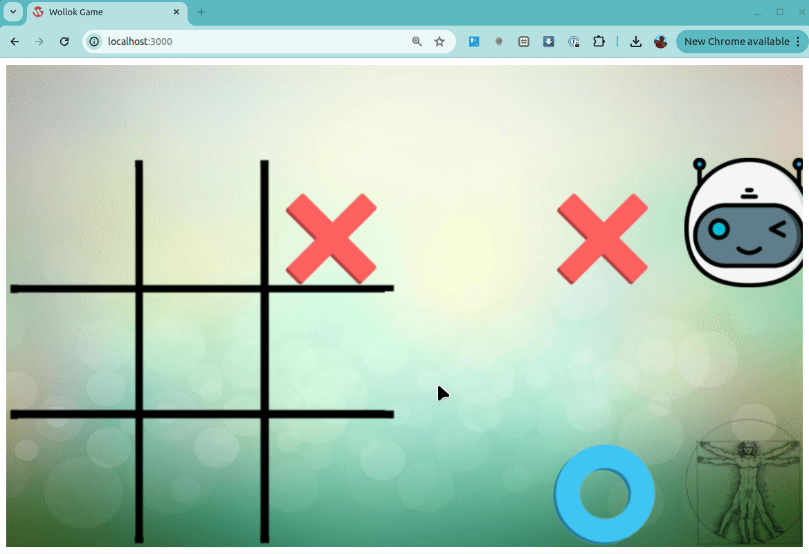

# Tateti

## Wollok Game

**Juego de tatetí clásico, para jugar contra la máquina.
También permite partidas entre dos personas o máquina-máquina.** 

### Instrucciones

##### Inicio
La máquina juega con Cruces y empieza a jugar. El jugador utiliza Círculos. 

Junto a cada signo se indica con una imagen si es la máquina o una persona.  

##### Comandos

- `<1>..<9>` Hacer una jugada en un casillero. (están numerados del 1 al 9, de izquierda a derecha, de arriba a abajo)
- `<Enter>` La máquina juega.
- `<Space>` Volver a empezar la partida 
- `<Up>` Cambiar modo de juego del jugador Cruz (Persona/Maquina) 
- `<Down>` Cambiar modo de juego del jugador Circulo (Persona/Maquina)

#### Desafíos

1) Mejorar la inteligencia de la máquina para jugar
2) Crear nuevas inteligencias artificiales, cada una con una estrategia diferente de juego y que puedan jugar entre sí.
3) Modificar interfaz gráfica y usabilidad

#### Autores

Primera version hecha por estudiantes de Paradigmas de Programacion (UTN - FRBA) Matías Giorda y Melanie Ibañez
https://github.com/matigiorda/TaTeTiWollokGame

Actualización por el docente Lucas Spigariol